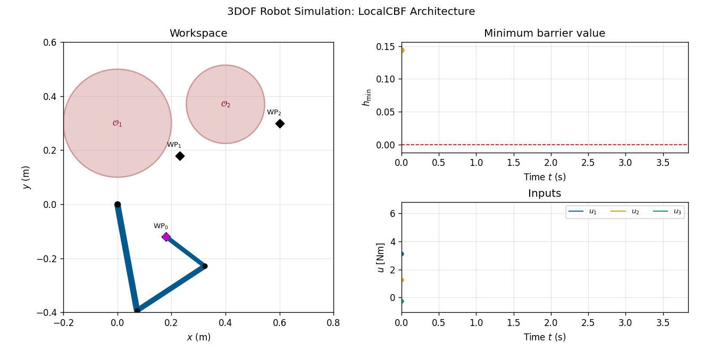
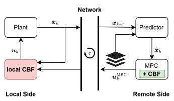

# Simulation Code: Where To Put Safety? Control Barrier Function Placement in Networked Control Systems

This repository contains the Python code accompanying the paper

> [Where To Put Safety? Control Barrier Function Placement in Networked Control Systems](https://arxiv.org/abs/2603.29792)
> by S. Beger, Y. Chen and S. Hirche.

submitted to IEEE Control System Letters 2026.

<p align="center">

</p>

This repository simulates a 3 DoF planar robot conducting a pick-and-place task with obstacle avoidance.
A model predictive controller creates a desired path at 20 Hz, which a local PD+ controller tracks at 200 Hz.
We compare four safety-filter architectures:

* `Nominal`: no safety filter is considered.
* `LocalCBF`: a myopic CBF is placed locally before the PD+ controller.
* `MPC-CBF`: the remote MPC includes the CBF constraints.
* `Combined`: remote MPC-CBF and local myopic CBF are used together.

<p align="center">

</p>
<p align="center">
  Overview of the considered networked predictive control system.
  We analyse the robustness-performance tradeoff following from the different CBF placements in the control architecture.
</p>

## Quick Start Guide

Clone the repository and create a clean Python environment:

```bash
git clone https://github.com/TUM-ITR/WhereToPutSafety.git
cd WhereToPutSafety
python -m venv .venv
```

Activate the environment.

On Windows:

```bash
.venv\Scripts\activate
```

On Linux/macOS:

```bash
source .venv/bin/activate
```

Install the required packages:

```bash
pip install -r requirements.txt
```

Run the default example:

```bash
python main.py
```

The default example runs the `Combined` architecture with bounded disturbances. Simulation outputs as well as generated figures or animations are written to timestamped folders in `data/`.

## Running Simulations

The main simulation routines are implemented in `src/sim_module/sim_runner.py` and are exposed through the command-line interface in `main.py`.

The general command structure is:

```bash
python main.py --mode <mode> [options]
```

The available modes are:

| Mode                | Description                                                  |
| ------------------- | ------------------------------------------------------------ |
| `single`            | Run one simulation for one selected architecture.            |
| `compare`           | Run one simulation for each architecture.                    |
| `monte-carlo`       | Run Monte Carlo simulations for selected architectures.      |
| `delay-sweep`       | Run Monte Carlo simulations over several delay values.       |
| `disturbance-sweep` | Run Monte Carlo simulations over several disturbance bounds. |

Generated simulation data, plots, and animations are saved in timestamped folders under `data/`.

### Run a single architecture

The default single-run example uses the `Combined` architecture. 
A different architecture can be selected with `--architecture`:

```bash
python main.py --mode single --architecture LocalCBF
```

The available architecture names are:

| Architecture | Description                                               |
| ------------ | --------------------------------------------------------- |
| `Nominal`    | No safety filter is considered.                           |
| `LocalCBF`   | A myopic CBF is placed locally before the PD+ controller. |
| `MPC-CBF`    | The remote MPC includes the CBF constraints.              |
| `Combined`   | Remote MPC-CBF and local myopic CBF are used together.    |

For single runs, plots and animation are enabled by default. They can be disabled with:

```bash
python main.py --mode single --architecture Combined --no-plot --no-animate
```

### Compare all architectures

The comparison mode runs all four architectures:

```bash
python main.py --mode compare
```

Disturbances can be disabled with the additional flag `--no-disturbances`.

### Run Monte Carlo simulations

Monte Carlo simulations can be run with:

```bash
python main.py --mode monte-carlo --trials 50 --architectures LocalCBF MPC-CBF Combined
```

By default, individual plots and animations are disabled for Monte Carlo runs to reduce computation time. Summary plots can be enabled with `--summary-plot`.

### Run a delay sweep

A delay sweep can be run with:

```bash
python main.py --mode delay-sweep --trials 20 --delays 1 3 7 10
```
The selected architectures can be specified using `--architectures LocalCBF MPC-CBF Combined`.
If no delay values are provided, the default delay sweep values from `src/sim_module/params.py` are used.
All delays here are known, compensated delays. To add uncompensated delays, please change `params.tau_residual`.

### Run a disturbance sweep

A disturbance sweep can be run with:

```bash
python main.py --mode disturbance-sweep --trials 20 --disturbances 0.005 0.01 0.02 0.03
```

The selected architectures can be specified as `--architectures LocalCBF MPC-CBF Combined`.

If no disturbance bounds are provided, the default disturbance sweep values from `src/sim_module/params.py` are used.

### Plotting and animation flags

The following flags control output generation:

| Flag                | Effect                                                               |
| ------------------- | -------------------------------------------------------------------- |
| `--plot`            | Generate plots for individual runs.                                  |
| `--no-plot`         | Disable plots for individual runs.                                   |
| `--animate`         | Generate animations for individual runs.                             |
| `--no-animate`      | Disable animations for individual runs.                              |
| `--summary-plot`    | Generate summary plots for comparison, Monte Carlo, and sweep modes. |
| `--no-summary-plot` | Disable summary plots.                                               |

For example, to run a fast single simulation without animation:

```bash
python main.py --mode single --architecture Combined --no-animate
```


## Repository Organization

```text
WhereToPutSafety/
├── README.md
├── requirements.txt
├── main.py
├── assets/
│   ├── robot.gif
│   └── SystemOverview.svg
├── data/
│   └── .gitignore
└── src/
    ├── controller_module/
    │   ├── local_cbf.py
    │   ├── pd_plus.py
    │   └── remote_mpc_cbf.py
    ├── plant_module/
    │   └── robot_dynamics.py
    ├── predictor_module/
    │   └── state_predictor.py
    ├── sim_module/
    │   ├── data_recorder.py
    │   ├── generate_disturbance.py
    │   ├── obstacles.py    
    │   ├── params.py
    │   └── sim_runner.py
    └── helper/
        ├── analysis/
        │   ├── post_processing.py
        │   └── post_processing_MonteCarlo.py
        └── plot_code/
            ├── plots_for_paper.py
            └── plotting_3dof.py
```

The main modules are:

* `controller_module`: remote MPC-CBF, local CBF, and local PD+ tracking control.
* `plant_module`: 3 DoF planar robot dynamics and kinematics.
* `predictor_module`: delay compensation through state prediction.
* `sim_module`: simulation loop, obstacle definitions, disturbance generation, and data recording.
* `helper/analysis`: post-processing and paper-plot routines.
* `helper/plot_code`: plotting, animation, and trajectory export utilities.

Generated simulation data is intentionally excluded from version control. The `data/` folder is kept as output location, but their generated contents should not be committed.

## Installation and Requirements

The code was tested with Python 3.10. It uses the following main packages:

* `numpy`
* `scipy`
* `pandas`
* `matplotlib`
* `casadi`
* `cvxpy`
* `openpyxl`
* `pillow`

The optimal control problem is solved with [Casadi (click for references)](https://web.casadi.org/).  
Install all dependencies with:

```bash
pip install -r requirements.txt
```

The simulations can be computationally demanding because the remote MPC and the local CBF are solved repeatedly along the trajectory. For a quick test, reduce `params.N_horizon` or the number of Monte Carlo trials.

## Reference

If you use this software in your research, please cite:

```bibtex
@article{WhereToPutSafety2026,
 title={Where To Put Safety? Control Barrier Function Placement in Networked Control Systems},
 author={Beger, Severin and Chen, Yuling and Hirche, Sandra},
 journal={arXiv preprint arXiv:2603.29792},
 year={2026}
}
```
