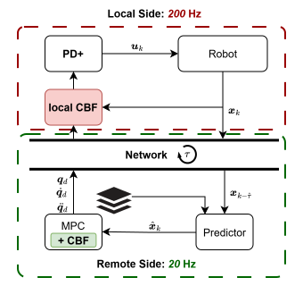

# Method Overview

This document gives an implementation-level overview of the main simulation modules used in this repository. The purpose is not to restate the complete theoretical development from the accompanying paper, but to explain how the simulated robot, controllers, predictor, and experiment parameters are implemented.

The simulation considers a 3-DoF planar robot (subject to gravity) performing a waypoint-reaching task under obstacle-avoidance constraints. The system is evaluated under different placements of control barrier functions (CBFs) in a networked control architecture.

## 1. Robot Model and Dynamics

The simulated plant is a 3-DoF planar rigid-body manipulator with revolute joints. The generalized coordinates are
$
q =
\begin{bmatrix}
q_1 & q_2 & q_3
\end{bmatrix}^\top,
\qquad
\dot q =
\begin{bmatrix}
\dot q_1 & \dot q_2 & \dot q_3
\end{bmatrix}^\top
$.

The true plant dynamics are modeled using the standard manipulator equation

$$
M(q)\ddot q + C(q,\dot q)\dot q + G(q) + D\dot q = \tau_{u} + \tau_{\mathrm{ext}}.
$$

$M(q)$ is the inertia matrix, $C(q,\dot q)\dot q$ collects Coriolis and centrifugal terms, $G(q)$ is the gravity vector, $D\dot q$ represents viscous joint friction, $\tau_u$ is the commanded joint torque, and $\tau_{\mathrm{ext}}$ are external disturbance torques.

 In particular, while the Coriolis terms are obtained from the Christoffel symbols associated with the inertia matrix. A standard reference for this formulation is . Further standard references are Spong, Hutchinson, and Vidyasagar, *Robot Modeling and Control*, and Slotine and Li, *Applied Nonlinear Control*.

### 1.1 Inertia, Coriolis, and Gravity Terms
The rigid-body dynamics follow the standard formulation for serial robotic manipulators. For more detail please refer to [Murray, Li, and Sastry, *A Mathematical Introduction to Robotic Manipulation*](https://www.ce.cit.tum.de/fileadmin/w00cgn/rm/pdf/murray-li-sastry-94-complete.pdf).

For a serial manipulator, the inertia matrix can be constructed from translational and rotational Jacobians of the link center-of-mass frames

$$
M(q) =\sum_{i=1}^{3}\left( m_i J_{v_i}(q)^\top J_{v_i}(q) + J_{\omega_i}(q)^\top I_i J_{\omega_i}(q)\right),
$$

where $m_i$ is the mass of link $i$, $I_i$ is the corresponding link inertia, $J_{v_i}(q)$ is the translational Jacobian of the center of mass of link $i$, and $J_{\omega_i}(q)$ is the angular-velocity Jacobian.

The Coriolis matrix is obtained from the Christoffel symbols

$$
C_{ij}(q,\dot q) = 
\sum_{k=1}^{3}
c_{ijk}(q)\dot q_k,$$

with
$c_{ijk}(q) =
\frac{1}{2}
\left(\frac{\partial M_{ij}}{\partial q_k} + \frac{\partial M_{ik}}{\partial q_j} -\frac{\partial M_{jk}}{\partial q_i} \right)$.

The gravity vector is obtained from the potential energy $P(q)$ as

$$
G_i(q)=\frac{\partial P(q)}{\partial q_i}.
$$

In the implementation, these terms are evaluated for the planar 3-link robot in `src/plant_module/robot_dynamics.py`.

### 1.2 Disturbance Model

External disturbances are modeled as additive torques $\tau_{\mathrm{ext}}$ acting on the joints. This choice represents external generalized forces or unmodeled torque-level perturbations, rather than direct state disturbances. Disturbances are sampled as clipped zero-mean Gaussian functions. The disturbance sequence is generated in `src/sim_module/generate_disturbance.py`.

### 1.3 Acceleration-Level Model Used by the MPC and CBFs

While the true plant is simulated using the full manipulator dynamics, the remote MPC and the local CBF filter operate on an acceleration-level model. The resulting input at this level is the desired joint acceleration

$$
u_k = \ddot q_{\mathrm{des},k}.
$$

For a sampling time $\Delta t$, the discrete-time prediction model is

$$
\begin{align}
q_{k+1}
&= q_k + \Delta t \dot q_k + \frac{1}{2}\Delta t^2 u_k,\\
\dot q_{k+1} &= \dot q_k +\Delta t u_k.
\end{align}
$$

Equivalently, with the state
$x_k =
\begin{bmatrix}
q_k \\
\dot q_k
\end{bmatrix},
$
the prediction model can be written as $x_{k+1} = f_{\mathrm{acc}}(x_k,u_k)$.


This acceleration-level model is used by the remote MPC and by the local CBF filter. The resulting acceleration reference is tracked by the local low-level PD+ controller, which generates torque commands for the true manipulator dynamics.

### 1.4 Two Time Scales

The simulation uses two sampling rates:

* local control rate: $200,\mathrm{Hz}$, corresponding to $\Delta t_{\mathrm{local}} = 5\,\mathrm{ms}$;
* remote MPC rate: $20,\mathrm{Hz}$, corresponding to $\Delta t_{\mathrm{remote}} = 50\,\mathrm{ms}$.

The local PD+ controller and the local CBF filter operate at the local sampling rate. The remote MPC computes acceleration-level commands at the remote sampling rate. Between remote updates, the most recently available remote command is held and applied at the local control rate in `src/sim_module/sim_runner.py`.
<p align="center">

</p>


## 2. Controllers and Safety Filters

The repository compares different placements of safety filters in a networked control architecture. The implemented architectures are:

* `Nominal`: no safety filter is used;
* `LocalCBF`: a myopic CBF filter is placed locally before the PD+ controller;
* `MPC-CBF`: the remote MPC includes CBF constraints;
* `Combined`: the remote MPC-CBF and the local CBF filter are used together.

The controller implementations are located in `src/controller_module/`.

## 2.1 Low-Level PD+ Controller

The local low-level controller tracks the acceleration-level reference produced by the remote MPC and optionally modified by the local CBF filter. The controller is implemented as a model-based PD+ controller and produces torque inputs:

$$
\tau_u= \underbrace{{M}(q)\ddot{q}_{d}+C(q_k,\dot{q})\dot{q}_d + G(q)}_{``+" \mathrm{ part}}\underbrace{-K(q-q_d)-D(\dot{q}-\dot{q}_d)}_{\mathrm{PD part}}$$

Here, $q_d$, $\dot q_d$, and $\ddot q_d$ are the desired joint position, velocity, and acceleration signals, while $K_p$ and $K_d$ are positive-definite gain matrices.

The PD+ controller is implemented in `src/controller_module/pd_plus.py`.


## 2.2 Local CBF Filter

The local CBF filter is a myopic safety filter operating at the local control rate. It modifies the acceleration-level input before the PD+ controller tracks it. The local CBF is formulated as an optimization problem over the acceleration command $u_k$.

The nominal acceleration command is denoted by $u_{\mathrm{nom},k}$. The local CBF solves a problem of the form

$$\begin{aligned}
u_k^\star = \arg\min_{u_k} \quad &
\lVert u_k - u_{\mathrm{nom},k}\rVert^2 \\
\mathrm{s.t.}
\quad &
h_j(x_{k+1}) \geq (1-\gamma)h_j(x_k),
\qquad j \in \mathcal{J}, \\
&x_{k+1} = f_{\mathrm{acc}}(x_k,u_k),\\
&u_k \in \mathcal{U}.
\end{aligned}
$$

Here, $h_j$ for all $j \in \mathcal{J}$ are the CBFs associated with robot-obstacle pairs, $\gamma \in (0,1]$ is the discrete-time CBF rate, and $\mathcal{U}$ denotes optional acceleration constraints.

The local CBF is implemented in `src/controller_module/local_cbf.py` using CasADi.


## 2.3 Barrier Functions and Protected Robot Points

Obstacle avoidance is enforced by distance-based barrier functions. For a robot point $p_j(q)$ and a circular obstacle with center $p_{\mathrm{obs},i}$ and radius $r_i$, a typical barrier function is

$$
h_{ij}(q) = \lVert p_j(q) - p_{\mathrm{obs},i} \rVert ^2 - (r_i+\epsilon)^2,
$$

where we have considered an additional safety margin $\epsilon \geq 0$.
Besides the joint positions, we have added a further discretization of the robot links into points, for which barrier functions are considered additionally. While this increases the problem size, it also reduces the risk of a link colliding with a circular obstacle.
In our evaluation, we regard a run as unsafe if a single point collides with an obstacle, i.e. $\lVert p_j(q) - p_{\mathrm{obs},i} \rVert < r_i$ (not considering the safety margin). This lets us introduce a slack variable to the local CBF, easing the feasibility of the problem. 


## 2.4 Remote MPC

### Remote MPC Problem

The remote MPC operates on the acceleration-level state

$x_j =\begin{bmatrix}
q_j \
\dot q_j
\end{bmatrix},$

where $q_j \in \mathbb{R}^3$ are the joint angles and $\dot q_j \in \mathbb{R}^3$ are the joint velocities. The "control input" and thus the MPC decision variable is the desired joint acceleration $u_j = \ddot q_{\mathrm{d},j}$.

At each remote control update, the MPC is initialized with the predicted state estimate $\hat x_k$ and solves an optimal control problem over a horizon of length $N$. It uses the acceleration level dynamics described above in (1).  
The implemented MPC minimizes a joint-space tracking objective with additional penalties on joint velocity, acceleration effort, and acceleration changes (a.k.a. jerk):

$$\begin{aligned}
\min_{u_0,\ldots,u_{N-1}}\quad
J = &\sum_{j=0}^{N-1}
\Big(\lVert q_j-q_{d,j} \rVert_{Q_q}^2 +
\lVert \dot{q}_j-\dot{q}_{d,j} \rVert_{Q_{v}}^2 +
\lVert u_j \rVert_{R}^2 +
\lVert \Delta u_j \rVert_{R_{\mathrm{jerk}}}^2
\Big)\\
&+ \lVert q_N-q_{d,N} \rVert_{Q_{qN}}^2
+ \lVert \dot{q}_N-\dot{q}_{d,N} \rVert_{Q_{vN}}^2
+ \rho \delta_i ^2 \\
\mathrm{s.t.} \quad &
x_0 = \hat x_k,\\
&x_{j+1} = f_{\mathrm{acc}}(x_j,u_j),
\qquad j=0,\ldots,N-1,\\
&x_j \in \mathcal{X},\qquad j=0,\ldots,N,\\
&u_j \in \mathcal{U},\qquad j=0,\ldots,N-1.\\
&\delta_i \geq 0, \quad \rho > 0
\end{aligned}
$$

The joint-position tracking error is computed using the wrapped angle error

$$
e_{q,j} = \mathrm{wrap}(q_j - q_{\mathrm{ref},j}),
$$

to account for the periodicity of revolute joints. The acceleration-change term is defined as

$$
\Delta u_j =
\begin{cases}
u_0 - u_{\mathrm{prev}}, & j=0,\\
u_j - u_{j-1}, & j=1,\ldots,N-1,
\end{cases}
$$

where $u_{\mathrm{prev}}$ is the previously applied MPC acceleration command.

For the `MPC-CBF` and `Combined` architectures, the MPC additionally enforces discrete-time CBF constraints along the prediction horizon. In generic form, these constraints are

$$
h_\ell(x_{j+1})
\geq
(1-\gamma)h_\ell(x_j)-s_{\ell,j},
$$

for all active robot-point/obstacle barrier functions $h_\ell$, where $s_{\ell,j} \geq 0$ if slack variables are enabled. In the `Nominal` MPC case, these CBF constraints are omitted.

The remote MPC-CBF is implemented in `src/controller_module/remote_mpc_cbf.py` using CasADi.


## 3. Predictor and Network Delay

The networked control architecture includes a remote controller that receives delayed state information from the plant side. The predictor compensates for this delay by rolling the delayed state forward to the current or future control time.

The predictor is implemented in `src/predictor_module/state_predictor.py`.

## 3.1 Delayed State Information

Let $x_k$ denote the current local state and let $x_{k-\tau}$ denote the delayed state available to the remote controller. The remote controller does not directly observe $x_k$. Instead, it receives delayed measurements over the network.

The predictor constructs an estimate $\hat x_k$ from the delayed state $x_{k-\tau}$, the stored command history (acceleration values from the MPC), and the known model structure.

The delay is implemented using a double-ended queue of length $\tau$, adding current state values at one end and reading the delayed state from the other end. The predictor receives the first entry of the queue, which is $\tau$ steps old. The last $\tau$ commanded accelerations from the MPC are stored in a list in the predictor class.

## 3.2 Forward Rollout Predictor

The predictor uses a forward rollout based on the true robot model and the stored acceleration-level command history. The rollout is performed at the local sampling time to match the 200 Hz plant-side update rate.

Conceptually, the predictor computes new states using the known PD+ controller, the true rigid-body model, and switching the desired acceleration according to the stored MPC command history and the ratio between the remote and local sampling rates. A mismatch to the true state arises due to disturbances, which are not known and thus not considered at the predictor. In architectures using a local CBF, the predictor can account for the local safety filter as implemented in the simulation.


## 3.3 Relation to the Remote MPC

The remote MPC uses the predicted state as its initial condition. In this way, the remote controller solves an MPC problem based on an estimate of the state at the time at which the newly computed command will become relevant.

This delay-compensation mechanism is central to the comparison between local and remote CBF placement. A remote CBF is predictive and can reason over a horizon, but its constraints are imposed using delayed and predicted state information. A local CBF acts myopically, but it operates on the most recent local state and at a higher sampling rate.

It is possible to add uncompensated delay, by choosing `params.tau_residual > 0`. However, we have found that already a value of $2$ (i.e. $40$ms of uncompensated delay) causes oscillations.

## 4. Simulation Parameters Used in the Paper

This section summarizes the main parameter values used for the paper simulations. The authoritative implementation is in `src/sim_module/params.py`.

### 4.1 Robot Parameters

| Parameter                         |                  Value | Unit / comment |
| --------------------------------- | ---------------------: | -------------- |
| Link lengths $(L_1,L_2,L_3)$      | $(0.40,\ 0.30,\ 0.18)$ | m              |
| Link masses $(m_1,m_2,m_3)$       |    $(0.8,\ 0.6,\ 0.3)$ | kg             |
| Viscous friction coefficients $D$ |    $(0.5,\ 0.3,\ 0.1)$ | Nms/rad        |
| Gravity constant $g$              |                 $9.81$ | $m/s^2$        |

### 4.2 Sampling and Timing Parameters

| Parameter                                          |   Value | Unit / comment |
| -------------------------------------------------- | ------: | -------------- |
| Local control rate                                 |   $200$ | Hz             |
| Local sampling time $\Delta t_{\mathrm{local}}$    | $0.005$ | s              |
| Remote MPC rate                                    |    $20$ | Hz             |
| Remote MPC sampling time $\Delta t_{\mathrm{MPC}}$ |  $0.05$ | s              |

### 4.3 MPC Parameters

| Parameter                                      |                                     Value | Unit / comment   |
| ---------------------------------------------- | ----------------------------------------: | ---------------- |
| Prediction horizon $N$                         |                                      $30$ | remote MPC steps |
| Joint-position weight $Q_q$                    |  $\mathrm{diag}(10.0,\ 10.0,\ 5.0)$ | -                |
| Joint-velocity weight $Q_v$                    |    $\mathrm{diag}(5.0,\ 5.0,\ 5.0)$ | -                |
| Input acceleration weight $R$                  |    $\mathrm{diag}(5.0,\ 5.0,\ 3.0)$ | -                |
| Acceleration-change weight $R_{\mathrm{jerk}}$ |    $\mathrm{diag}(2.0,\ 2.0,\ 1.0)$ | -                |
| Terminal joint-position weight $Q_{q,N}$       | $\mathrm{diag}(50.0,\ 50.0,\ 50.0)$ | -                |
| Terminal joint-velocity weight $Q_{v,N}$       | $\mathrm{diag}(30.0,\ 30.0,\ 15.0)$ | -                |
| Acceleration bound                             |                                      $20$ | $rad/s^2$        |

### 4.4 CBF Parameters

| Parameter                    |     Value | Unit / comment                 |
| ---------------------------- | --------: | ------------------------------ |
| CBF rate $\gamma$            |     $0.3$ | -                              |
| Safety margin $\epsilon$     |   $0.005$ | m                              |
| Additional robot-link points |       $3$ | per link                       |
| Slack penalty                | $10^{10}$ | if slack variables are enabled |

### 4.5 Disturbance Parameters

| Parameter                      |            Value | Unit / comment |
| ------------------------------ | ---------------: | -------------- |
| Disturbance type               | clipped Gaussian | zero mean      |
| Disturbance bound              |            $0.2$ | Nm             |
| Disturbance standard deviation |            $0.1$ | Nm             |
| Initial random seed            |             $42$ | -              |

For sweep experiments, the seed is incremented by one for each sweep iteration.

### 4.6 Task and Obstacle Setup

| Parameter                  |                           Value | Unit / comment |
| -------------------------- | ------------------------------: | -------------- |
| Initial end-effector point |                $(0.18,\ -0.12)$ | m              |
| Number of target waypoints |                             $2$ | -              |
| Target waypoint positions  | $(0.23,\ 0.18),\ (0.60,\ 0.30)$ | m              |
| Number of obstacles        |                             $2$ | -              |
| Obstacle centers           | $(0.00,\ 0.30),\ (0.40,\ 0.37)$ | m              |
| Obstacle radii             |                $(0.20,\ 0.145)$ | m              |


## 5. Notes on Supporting Code

Several additional modules are used for setup, data recording, plotting, and post-processing:

* `src/sim_module/data_recorder.py` records simulation trajectories and metadata.
* `src/sim_module/obstacles.py` defines obstacle objects and obstacle scenes.
* `src/helper/plot_code/` contains plotting and animation utilities.
* `src/helper/analysis/` contains post-processing routines for single runs, Monte Carlo runs, and parameter sweeps.

These modules are primarily implementation utilities. Their behavior is documented through code comments and the command-line examples in the main `README.md`.

## References

For more detail regarding the implemented robot dynamics and model-based control structure please refer to:

```bibtex
@book{Murray1994,
  title     = {A Mathematical Introduction to Robotic Manipulation},
  author    = {Murray, Richard M. and Li, Zexiang and Sastry, S. Shankar},
  year      = {1994},
  publisher = {CRC Press}
}
```

All optimal control problems were solved with Casadi:
```bibtex
@Article{Andersson2019,
  author = {Joel A E Andersson and Joris Gillis and Greg Horn
            and James B Rawlings and Moritz Diehl},
  title = {{CasADi} -- {A} software framework for nonlinear optimization
           and optimal control},
  journal = {Mathematical Programming Computation},
  volume = {11},
  number = {1},
  pages = {1--36},
  year = {2019},
  publisher = {Springer},
  doi = {10.1007/s12532-018-0139-4}
}
```
